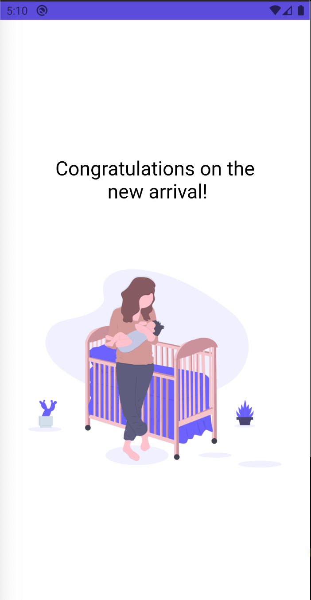

# Keleya Mobile App


 


## Installation

- Any Operating System (ie. MacOS X, Linux, Windows)
- Any IDE with Flutter SDK installed (ie. IntelliJ, Android Studio, VSCode etc)


```bash
  flutter pub get
```
App directory
- lib
  - screens
  - utils
  - widgets

Run on android
```
flutter run android
```

Run on ios

```
flutter run ios
```

## Screenshots
| 1 | 2|
|------|-------|
|||
| 3 | 4|
|------|-------|
|||
| 5 | 6|
|------|-------|
|||


A few resources to get you started if this is your first Flutter project:

- [Lab: Write your first Flutter app](https://flutter.dev/docs/get-started/codelab)
- [Cookbook: Useful Flutter samples](https://flutter.dev/docs/cookbook)

For help getting started with Flutter, view our
[online documentation](https://flutter.dev/docs), which offers tutorials,
samples, guidance on mobile development, and a full API reference.
